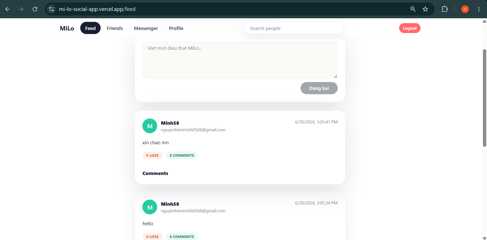
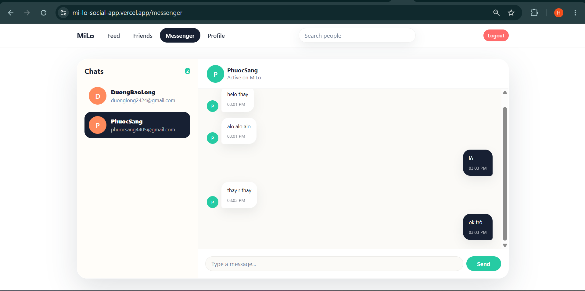

# MiLo Social App

MiLo is a real-time social web application where users can register, discover friends, create posts, manage profiles, and chat instantly with SignalR.

## Demo

### Social Feed



### Real-Time Chat



## Main Features

- **User Authentication:** Register and log in with ASP.NET Core Identity and JWT bearer tokens.
- **Global Search:** Search for users from the navigation bar.
- **User Profiles:** View and edit profile details, avatar URLs, and biography text.
- **Friend Requests:** Send, accept, decline, and remove friend connections.
- **Real-Time Messenger:** Chat with friends through ASP.NET Core SignalR.
- **Video Calling:** Start Jitsi Meet video calls from an active chat.
- **Social Feed:** Create posts and view community updates.

## Tech Stack

### Frontend

- React + TypeScript
- Vite
- Chakra UI
- Axios
- React Router DOM
- `@microsoft/signalr`

### Backend

- ASP.NET Core Web API on .NET 10
- Entity Framework Core
- PostgreSQL with Npgsql
- ASP.NET Core Identity
- JWT authentication
- SignalR hubs
- Jitsi Meet video rooms

## Project Structure

```text
MiLo-Social-App/
|-- backend/
|   |-- Controllers/      # REST API endpoints
|   |-- Data/             # EF Core DbContext
|   |-- Hubs/             # SignalR hubs
|   |-- Migrations/       # EF Core migrations
|   |-- Program.cs        # Backend startup and middleware
|   `-- backend.csproj
|-- frontend/
|   |-- public/
|   |-- src/
|   |   |-- components/
|   |   |-- config/
|   |   `-- services/
|   |-- vercel.json
|   `-- package.json
|-- docs/
|   `-- images/           # README demo screenshots
|-- docker-compose.yml
`-- render.yaml
```

## Environment Variables

### Backend

For local development, configure `backend/appsettings.Development.json` or environment variables:

```json
{
  "ConnectionStrings": {
    "DefaultConnection": "Host=localhost;Port=5432;Database=milo;Username=postgres;Password=your_password"
  },
  "Jwt": {
    "Key": "a_long_random_secret_for_jwt_signing"
  }
}
```

For Render, set:

```env
ConnectionStrings__DefaultConnection=Host=your-neon-host;Port=5432;Database=neondb;Username=your_user;Password=your_password;SSL Mode=Require
Jwt__Key=your_long_random_secret
FrontendOrigins=https://your-vercel-app.vercel.app
ASPNETCORE_ENVIRONMENT=Production
```

### Frontend

For local development or Vercel:

```env
VITE_API_URL=http://localhost:8080/api
```

For production on Vercel:

```env
VITE_API_URL=https://your-render-backend.onrender.com/api
```

## Local Development

### Option 1: Docker Compose

```bash
docker compose up -d --build
```

Frontend:

```text
http://localhost
```

Backend:

```text
http://localhost:8080
```

### Option 2: Run Services Manually

Start PostgreSQL first, then run the backend:

```bash
cd backend
dotnet run
```

Run the frontend:

```bash
cd frontend
npm install
npm run dev
```

Frontend development server:

```text
http://localhost:5173
```

## Deployment

The current deployment setup is:

- Frontend: Vercel
- Backend: Render Web Service with Docker
- Database: Neon PostgreSQL

### Render Backend

This repo includes `render.yaml`. Create a Render Blueprint from the repository and provide:

```env
ConnectionStrings__DefaultConnection=Host=your-neon-host;Port=5432;Database=neondb;Username=your_user;Password=your_password;SSL Mode=Require
FrontendOrigins=https://your-vercel-app.vercel.app
```

Render builds the backend from:

```text
backend/Dockerfile
```

### Vercel Frontend

Use these Vercel settings:

```text
Framework Preset: Vite
Root Directory: frontend
Build Command: npm run build
Output Directory: dist
```

Set:

```env
VITE_API_URL=https://your-render-backend.onrender.com/api
```

## Notes

- The backend root URL can return `404` because the API does not define a `/` route. Use `/api/...` routes from the frontend.
- The backend applies EF Core migrations at startup.
- Render free instances may sleep when idle, so the first request can be slow.
